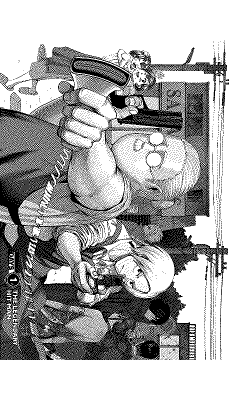
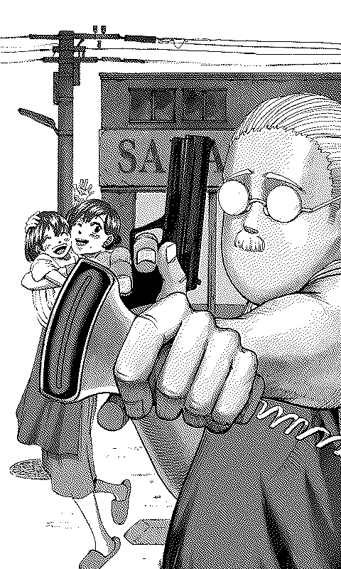
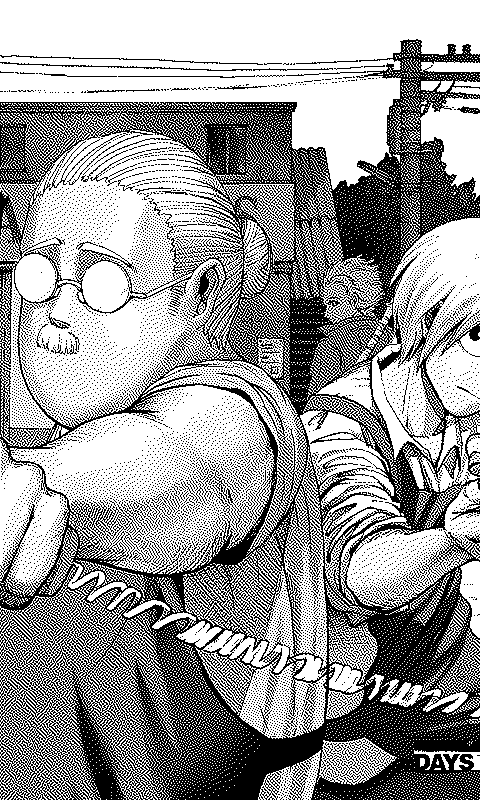
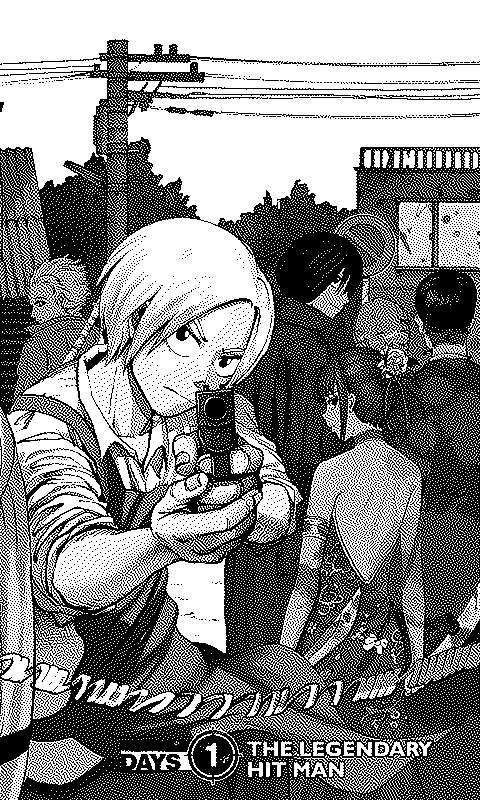
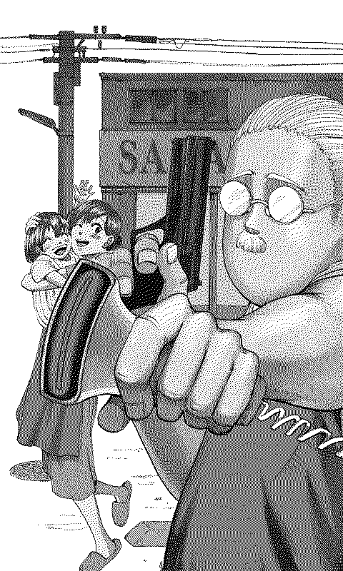
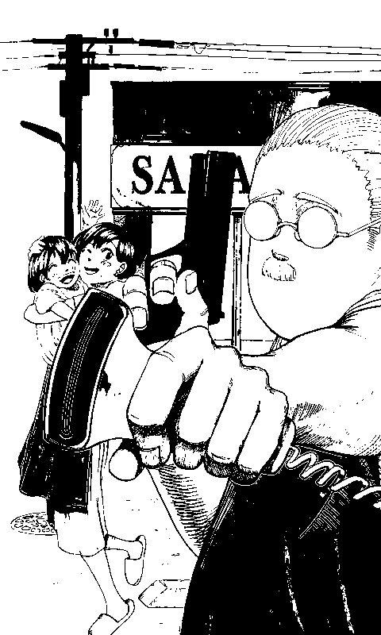
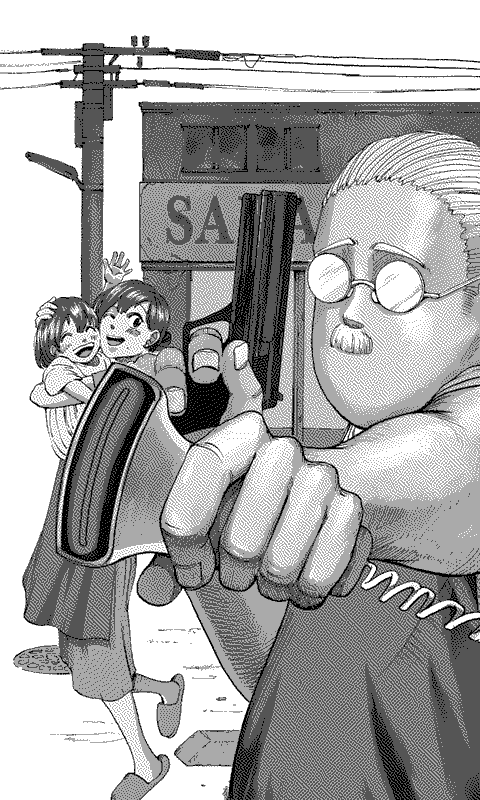

# XTEink Manga Tools

Tools for converting CBZ, PDF, and images to XTC/XTCH format for XTEink X4 and X3 e-readers.

## Installation

### 1. Install Python
- **Windows**: Download from [python.org](https://www.python.org/). During installation, check "Add Python to PATH".
- **macOS**: Run `brew install python` or download from [python.org](https://www.python.org/).
- **Linux**: Usually pre-installed. If not, use `sudo apt install python3`.

### 2. Install Required Libraries
Open your terminal (Command Prompt on Windows, Terminal on macOS/Linux) and run:
```bash
pip install pillow numpy numba pymupdf playwright
```

### 3. Web Support (For web2xtc.py)
After installing playwright (above), you must install the browsers:
```bash
playwright install
```

### 4. Video Support (For video2xtc.py)
Install `ffmpeg`:
- **macOS**: `brew install ffmpeg`
- **Linux**: `sudo apt install ffmpeg`
- **Windows**: Download from [ffmpeg.org](https://ffmpeg.org/download.html) and add to PATH.

### 5. PDF Support
- For `cbz2xtc.py`: `pymupdf` (installed above) is used.
- For `cbz2xtcpoppler.py`: Install `poppler-utils`.
  - **macOS**: `brew install poppler`
  - **Linux**: `sudo apt install poppler-utils`
  - **Windows**: Download binaries and add to PATH.

## How to Run

1. Place your `.cbz`, `.pdf`, or video files in a folder.
2. Open your terminal in that folder.
3. Run the script:

**Windows**:
```cmd
python cbz2xtc.py <options>
```

**macOS / Linux**:
```bash
python3 cbz2xtc.py <options>
```

### Running web2xtc.py (Website Converter)
```bash
python3 web2xtc.py "https://example.com/manga" <options>
```

### Running video2xtc.py (Video Converter)
```bash
python3 video2xtc.py movie.mp4 <options>
```
## CLI Examples
Open your terminal (Command Prompt on Windows, Terminal on macOS/Linux) and run:
### cbz2xtc.py or cbz2xtcpoppler.py
The default is xtc 1-bit.
- for 2-bit manga with high quality dithering
```bash
python cbz2xtc.py --2bit --landscape-rtl --sideways-overviews --dither zhoufang
```
- for manhwa
```bash
python cbz2xtc.py --manhwa --downscale bicubic
```
- for pdf
```bash
python cbz2xtc.py --2bit --downscale bicubic
```
- for XTEink X3 (528x792)
```bash
python cbz2xtc.py --device X3 --2bit
```
### cbz2xth.py
```bash
python image2xth.py input.png --downscale bicubic
```
### web2xtc.py
- for mobile Continuous portrait scrolling.
```bash
python web2xtc.py 'https://example.com/' --viewport mobile --downscale bicubic
```
- for mobile Continuous portrait scrolling with 1st page hyperlinks as TOC chapters.
```bash
python web2xtc.py 'https://example.com/' --viewport mobile --dynamic --parallel-links --downscale bicubic
```
- for mobile Continuous portrait scrolling with 1st page hyperlinks as TOC chapters and with cookies for websites like forums and social media.
```bash
python web2xtc.py 'https://example.com/' --viewport mobile --dynamic --parallel-links --cookies cookie.txt --downscale bicubic
```
### video2xtc.py
```bash
python video2xtc.py video.mp4
```


## Tools

### cbz2xtc.py
Processes multiple pages and files in parallel.
- **Split segments**: Automatically cuts landscape spreads into upright portrait pieces.
- **Overviews**: Generates full-page views to show the layout before the splits.
- **Fast Encoding**: Uses NumPy to process images quickly.

### cbz2xtcpoppler.py
An alternative PDF converter that uses Poppler for potentially better rendering on some PDFs.

### web2xtc.py
Converts websites directly to XTC/XTCH format.
- **Full Page Capture**: Screenshots the entire scrolling page.
- **Dynamic Mode**: Expands dropdowns and crawls links (chapters/sub-pages).
- **Mobile/Desktop**: Mobile or Desktop viewport.

### video2xtc.py
Converts video files (MP4, MKV, AVI, etc.) to XTC/XTCH format.
- **FPS Control**: Extract frames at a custom rate (e.g., 1 frame per second).
- **Auto-Rotation**: Automatically rotates landscape videos to fit the portrait screen.
- **High Performance**: Uses FFmpeg for extraction and Numba for fast dithering.

### image2xth.py
Converts a single image (like a wallpaper) to XTCH (2-bit grayscale) format.
- Supports **Cover**, **Letterbox**, and **Fill** modes.

### Dithering Options
Available for all tools (`--dither <algo>`):
| Algorithm | Description |
| :--- | :--- |
| `stucki` | (Default) High-quality error diffusion, sharpest details. |
| `atkinson` | Sharp error diffusion, good contrast preservation. |
| `ostromoukhov` | (Experimental) Variable-coefficient error diffusion, smooth "blue noise" look. |
| `zhoufang` | (Experimental) High-quality 12-pixel kernel, reduced artifacts/worms. |
| `floyd` | Floyd-Steinberg. Standard smooth gradients. |
| `ordered` | Bayer matrix ordered dithering (grid pattern). |
| `rasterize` | Halftone style (cbz/web only). |
| `none` | Pure threshold (no dithering). Best for crisp text. |

### Orientation Options
Available for `image2xth.py` and `cbz2xtc.py` (`--orientation <mode>`):
| Mode | Description |
| :--- | :--- |
| `portrait` | (Default) Standard upright orientation. Auto-rotates wide spreads (-90°). |
| `landscape` | Rotates image **90° clockwise** (top becomes right). |
| `landscape-flipped` | Rotates image **90° counter-clockwise** (-90°, top becomes left). |
| `portrait-flipped` | Rotates image **180°** (upside down). |

## Options Reference

### General Options (cbz2xtc, web2xtc, video2xtc, image2xth)
| Option | Effect |
| :--- | :--- |
| `--2bit` | Use 4-level grayscale (higher quality, larger file size). |
| `--device X4` | Target device: `X4` (480x800, default) or `X3` (528x792). |
| `--downscale bicubic` | Downscaling filter: bicubic (default), bilinear, box, lanczos, nearest. |
| `--dither <algo>` | Choose dithering algorithm (see above). |
| `--gamma 0.7` | Brighten the image (use values like 0.5 to 0.9). |
| `--invert` | Invert colors (White <-> Black). |
| `--clean` | Delete temporary files after the conversion is done. |

### Tool-Specific Options

#### cbz2xtc.py (Manga/PDF)
| Option | Effect |
| :--- | :--- |
| `--manhwa` | Use 75% vertical overlap for long-strip webtoons. |
| `--landscape-rtl` | Process wide pages from Right-to-Left (for Japanese manga). |
| `--include-overviews` | Add an upright full-page preview before segments. |
| `--sideways-overviews` | Add a rotated full-page preview (-90 degrees). |
| `--orientation <mode>` | Force rotation mode (see above). |
| `--hsplit-count <N>` | Split page horizontally into N segments (for panoramas). |

#### video2xtc.py (Video)
| Option | Effect |
| :--- | :--- |
| `--fps 1.0` | Frames per second to extract (Default: 1.0). |

#### web2xtc.py (Web)
| Option | Effect |
| :--- | :--- |
| `--dynamic` | Expands menus and crawls 1st-page links (chapters). |
| `--parallel-links` | Crawls sub-links in parallel (faster). |
| `--viewport mobile` | Use mobile layout (iPhone 13 Pro). Default is desktop. |
| `--cookies file.txt` | Load cookies from a Netscape-formatted file. |

#### image2xth.py (Single Image)
| Option | Effect |
| :--- | :--- |
| `--mode <mode>` | Scaling mode: `cover` (fill & crop), `letterbox` (fit & pad), `fill` (stretch), `crop` (no scale). |
| `--pad black` | Use black background instead of white for letterboxing. |
| `--orientation <mode>` | Force rotation mode (see above). |

## Visual Samples

The tool splits images into segments to fill the screen correctly. Here is how a wide spread is handled:

| Type | Image | Filename | Description |
| :--- | :---: | :--- | :--- |
| **Overview** |  | `_overview.png` | Full view of the spread. |
| **Segment A** |  | `_3_a.png` | First part (Left side by default). |
| **Segment B** |  | `_3_b.png` | Middle part (Overlap). |
| **Segment C** |  | `_3_c.png` | Last part (Right side by default). |

*Note: For Japanese manga, use `--landscape-rtl` so that Segment A is the Right side.*

### Dithering and Quality Previews

| Option | Preview | Description |
| :--- | :---: | :--- |
| **Stucki** |  | Default. High-quality error diffusion. |
| **Atkinson** |  | Sharp and clean shading. |
| **Floyd-Steinberg** |  | Smoother gradients, traditional look. |
| **No Dithering** |  | Pure Black & White. Best for text. |
| **2-bit Grayscale** |  | 4 levels of gray. Highest quality. |
